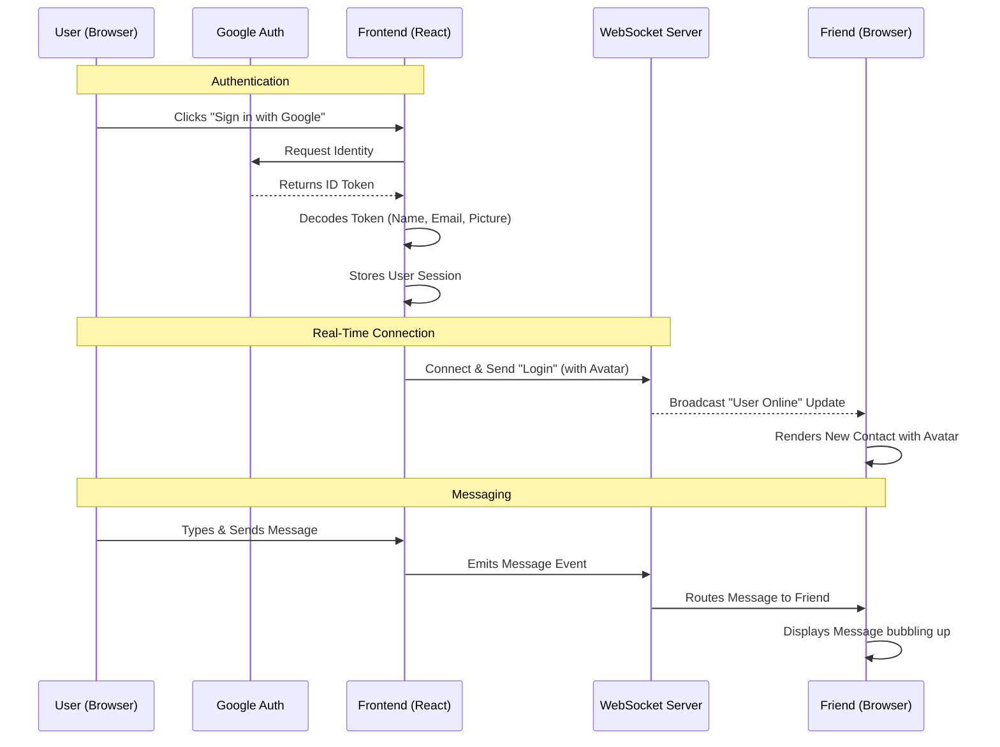

# ✨ Naza Chat App

Welcome to **Naza Chat**, a beautiful, real-time messaging experience designed to keep you connected with friends effortlessly. 🚀

---

## 🌟 Why You'll Love It

### 🔐 Seamless Google Sign-In
automatically sync your **profile picture** and **name**, so your friends know exactly who they're talking to instantly.

### ⚡ Instant, Real-Time Connection
Powered by **WebSockets**, messages verify and travel at the speed of light. See who comes online the moment they join. No refreshing required—it just feels *alive*.

---

## 🛠️ Under the Hood

How does it all work? Here is the flow of data across our system:



---

## � Run with Docker (Recommended)

Get the whole app running in seconds.

```bash
docker-compose up --build
```

The app will be available at `http://localhost:5173`.

---

## �🚀 Getting Started (Manual)

Want to run this locally without Docker? It's easier than you think.

### Prerequisites
*   Node.js installed on your machine.
*   A Google Cloud Project (for the Client ID).

### 1. Clone & Install
```bash
git clone https://github.com/your-repo/naza-chat.git
cd naza-chat
npm install
```

### 2. Configure Google Login
Open `src/components/Login.jsx` and add your **Google Client ID**:
```javascript
const GOOGLE_CLIENT_ID = "YOUR_CLIENT_ID_HERE";
```

### 3. Start the Engines
You need two terminals running:

**Terminal 1: The WebSocket Backend**
```bash
cd websocket-server
npm install
node server.js
```

**Terminal 2: The React Frontend**
```bash
# In the main folder
npm run dev
```

Visit `http://localhost:5173`, sign in, and start chatting! 💬

---

## 🛠 Tech Stack

*   **Frontend**: React, Vite, CSS3 (Glassmorphism & Flexbox).
*   **Auth**: OAuth 2.0 via `@react-oauth/google`.
*   **Backend**: Node.js, `ws` (Native WebSockets).
*   **Security**: JWT Decoding for secure session handling.

---

*Made with ❤️ by Le Hai*
